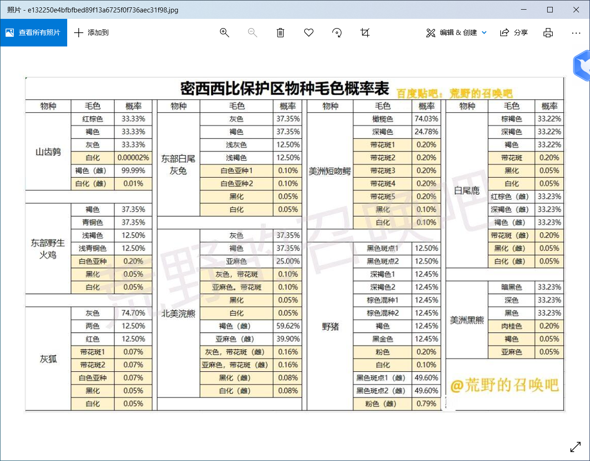

# Hello world!
## Hello.world!
### Hello world!

分割段落

**加粗**
*斜线*
~~删除线~~
==高亮==

---
 <!--三条横线表示分割线,后跟enter -->

* 列表1 <!--列表->嵌套列表转换使用Tab键，嵌套列表->列表使用del键 -->
  * 嵌套列表
  * 嵌套列表
* 列表2

1. 有序列表1 <!--同列表操作方法-->
   1. 有序列表嵌套
   2. 有序列表嵌套
2. 有序列表2

> 引用
> 这句话我说过 
> By鲁迅

行内有代码 <!--三点（行内代码开始）+语言名称(+{.line-numbers}表示行数)+代码+三点（行内代码结束）-->
``` java {.line-numbers}
printf("hello,world");
```
---
* 今日计划
  - [x] 已经完成的事
  - [ ] 未完成的事

[markdown示意图](https://pic1.zhimg.com/80/v2-cfcbfe6cf86e1ecdd5707549f12215e8_720w.png)
[markdown链接](https://orangex4.cool/post/notes-in-markdown/)

<!--截屏后ctrl+alt+v-->

---

表格
| 过去 | 现在 | 未来 |
| ---- | ---- | ---- |
| 内容 | 内容 | 内容 |
| ^    | 内容 | 内容 |

| 表头 | 表头 |
| ---- | ---- |
| 内容 | 内容 |
|>     | 内容 |

| 表头 | 表头 |
| ---- | ---- |
| 内容 | 内容 |
|  ^   | 内容 |

