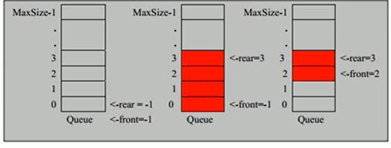

# Situation:线性结构和非线性结构 #
---
## Task1:线性结构与非线性结构的概念 <!-- the conception of linear structure and non-linear structure -->

### Action1: ###
1. 线性结构是指数据元素之间的映射是==一对一==的线性关系，非线性结构则是一对多非线性。
   ``` java
   a[0] = 30
   ```
2. 线性结构的存储方式有==顺序存储==和==链式存储==，顺序存储其存储地址是连续的，链式存储地址可以不连续，可以通过在链表里储存下一个链表的地址。
3. 属于线性结构：一维数组，链表，队列，栈
4. 属于非线性结构：二维及以上维数组，广义表，树结构，图结构。
---

## Task2:稀疏数组的概念及应用场景 ##

### Action2: ###

1. 在一个需要存储的大型多维数组中有==大量重复无意义的值==时，可使用==稀疏数组==只存储其中有效值进行==空间压缩==（时间换空间）。应用背景如：五子棋。

2. 稀疏数组可表示为：
``` java
int sparseArray[num+1][n+1] (其中num表示有效值，n表示原始数组的维数)
```
3. 稀疏数组有n+1列，其中每一行的前n列表示在原始数组的位置，最后一列表示该位置上的值。而第一行前n列表示原始数组的大小，最后一列表示该原始数组中一共有几个（其取值为num）有效值。

| 行   | 列   | 值   |
| ---- | ---- | ---- |
| 数组总行 | 数组总列 | 有效值个数num |
|第一个有效值的行|第一个有效值的列|有效值大小|
|……|……|……|

4. 思路分析：
   1. 保存数组 
      1. 有一个需要存储的多维数组，分析其中的值的有效性
      2. 遍历数组，找到对应位置以及值，创建稀疏数组   
      3. 转为稀疏数组来存储
   2. 在提取数组时
      1. 将数据文件转为稀疏数组
      2. 提取稀疏数据第一行创建原始数组，再将每一行对应位置赋值

5. 代码实现<!--  学习java编程后进行补充 -->
---

# Task3:队列的概念及应用场景（线性结构之一） #
## Action3: ##
1. 队列是一个==有序线性列表==，常用数组或者链表进行表示，常用场景为叫号排队。
2. 队列的数据处理遵循==先入先出==的原则。
3. 若使用数组（非环形）进行队列的表示，如下图：

4. 思路分析：
   1. 队列要实现的功能确定
      1. 队列最多能存放多少条数据
         1. 即表示队列的数组的最大长度Maxsize
      2. 队列的如何往后运动
         1. 定义两个变量front和rare，front指向队列首部，rare指向队列尾部的后一个位置
         2. 当front指向的队列首部数据被取出（除去）后，front++来表示队列往后运动
      3. 队列如何添加数据和查看当前队列数据
         1. 当队列添加数据时，检查rare的值是否为Maxsize（队列满），若不是则在rare所指向的队列尾部加入数据，然后rare++
         2. 查看队列数据则只需将front所指向的数据进行输出即可（不取出）
      4. 在队列为空时如何使队列不再往后运动
         1. 使$ front == rare $时，println一个队列为空即可
      5. 在队列为满时如何使队列不再添加数据
         1. 在$ rare == Maxsize   $时，println一个队列已满即可
   2. 优化分析：由于front和rare始终在往给定数组的Maxsize移动，而之前的空间则无法再次利用，因此会造成空间的浪费，使用环形队列更好，即取模判断
   3. 优化后的环形队列满足(约定数组中留一个空的位置，保证rare表示指针时仍在数组内)：
      1. 表示队列满时 ：( (rare + 1) % Maxsize ) == front 
      2. 表示队列空时 ：rare == front
      3. 如何表示循环利用：当 rare == Maxsize - 1时，进行队列满判断，若队列满，则不加入数据，若队列不满，加入该数据，重置rare = 0.即进行取模运算，在加入数据后，rare的位置为 (rare + 1) % Maxsize 
      4. 其中有效数据个数为
``` java
当rare > front 时， num = rare - front
当rare < front 时， num = rare + Maxsize - front
综上所述 num = (rare + Maxsize - front) % Maxsize 
```
5. 代码实现<!-- java学习后写 -->
