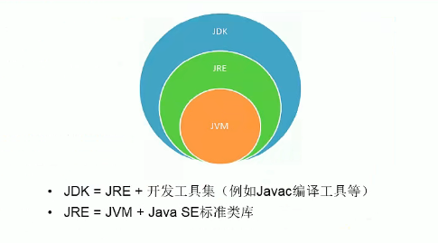

# Situation:day1 JAVA #
## Task1:JAVA语言特点##
### Action1: ###
1. 面向对象
   1. 类(class),对象
   2. 三个特点：继承，封装，多态
2. 健壮性：
   1. ==垃圾自动处理==
   2. 去除指针
3. 跨平台性
   1. ==基于JVM==的JAVA语言在不同系统中配置不同的JVM，JAVA语言编写后可在任意系统中的JVM运行。
---
## Task2:JDK JRE JVM ##
### Action2: ###

JDK = JRE + 开发工具(javac java等)
JRE = JVM + 核心的类库


---

## Task3:Path环境配置 ##
### Action3: ###
1. Path变量是什么
   1. Path变量存储了部分路径，在计算机执行文件对应程序时，在用户指明的路径中没有对应文件时，会在path变量下存储的路径下查找
2. 为什么要配置Path环境
   1. 为了在计算机任何地方都能调用某些常用的程序或开发工具
3. 如何配置(以配置JAVA为例)
   1. 找到JAVA安装目录下的bin文件(存储了开发工具)
   2. 将其上一级路径在系统中命名环境变量Java_Home
   3. 在path环境变量值添加引用(为一对$符号)的Java_Home/bin
---
## Task4:常见的命令行命令 ##
###   Action4 : ###
1. cd  
   1. cd d:(进入D盘)
   2. cd notes(在D盘下进入notes文件夹)
2. md(创建文件夹)
3. del(删除文件夹)
4. cd..(回到上一级)
5. cd xx/notes/java
---
## Task5:注释 ##
### Action5: ###
1. //单行注释
2. /* …… */多行注释
3. /** */文档注释
4. API文档注释(Application Programming interface 应用程序接口)，所到的类和库都可看作为API，在引用相应的类和库时，有对应的使用说明文档--->API文档
---
## Task6:编写JAVA程序—Helloworld ##
### Action6: ###
``` java {.line-numbers}
public class HelloWorld
{
    public static void main(String[] args)
    {
        System.out.println("Hello,world");
    }
}
```
---
## Task7:  关键字与标识符 ##
### Action7： ###
1. 关键字的定义：JAVA语言中，已经事先预定的，==全为小写==的字符串，作为程序编写中的特殊含义使用
2. 关键字举例：
   1. public，static，main，method，new等
3. 标识符：对包，类，方法，变量，常量的自主命名
   1. 标识符规则：
      1. 只能使用26个字符，_，$来组成
      2. 不能直接以关键字作为标识符，但可以包含关键字
      3. 首位不能用数字来标识，不能使用空格
   2. 标识符标准
      1. 包 xx_yyzz(全小写)
      2. 类，方法 XxYyZz(大驼峰)
      3. 变量名等 xxYyZz(小驼峰)
      4. 常量名 XX_YYZZ(全大写)
      5. 以实际作用意义来定义标识符
---
## Task8: 变量 ##
### Action8: ###
1. 变量实际上是一个==以变量名命名的一块内存空间==，空间的大小由变量的数据类型决定。
2. 变量是最基本的存储单元，由==变量类型==，==变量名==，==变量值== 组成。用于在内存中存储数据，用变量名来访问对应的内存空间。
3. 变量在使用前需要声明，比如
``` java {.line-numbers}
int myAge;//声明变量
myAge =12;//使用变量
System.out.println(myAge);
```
4. 变量只在其所定义的作用域中存在(在所定义的{}范围内)