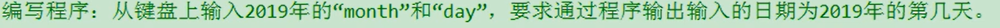

## Task1:运算符 ##
### Action1: ###
1. 运算符表示实现数据间的运算，赋值，比较等功能
2. 运算符分为==算术运算符==，==赋值运算符==，==比较运算符==，==逻辑运算符==，==位运算符==以及==三元运算符==。
   1. 算术运算符
       
       1. 前++为先++在运算，后++为先运算完当前表达式后，再++(包括比较)，==不改变原有的数据类型。==
       2. 连接符只适用与String与String或其他类型变量之间。
   2. 赋值运算符
       
``` java
int i1 = 3;
i1 += 4;//等于 i1 = i1 + 4 ;
``` 
   3. 比较运算符
   
      1. 比较运算符计算结果为boolean类型
      2. <= , >= , < , > ：只能用于数值类型数据之间
      3. == , != 还可以用于引用类型之间。
```java{.line-numbers}
Account acct1 = new Account(1000);
Account acct2 = new Account(1000);
boolean b1 = (acct1 == acct2);
boolean b2 = (acct1 != acct2);
```
   1. 逻辑运算符
   
      1. 逻辑与和或为符号前后的布尔类型条件式都要执行一遍
      2. 短路与和或为先执行符号前的布尔类型条件式，如果满足判断条件，就不再执行符号后的布尔类型条件式
         1. 短路与的判断条件为前表达式为false
         2. 短路或的判断条件为前表达式为true
      3. 异或理解为相同为false，不同为ture
   1. 位运算符
      1. 
         1. 位运算符是针对数值数据的二进制码进行计算
            1. 左移即将数据的二进制码向左移动，超出的高位舍去，空缺的低位以0补上，在允许范围内，左移n位<<相当于乘以2^n次方。
            2. 右移即将数据的二进制码向右移动，超出的低位舍去，空缺的高位以根据符号位判断，如果为负数(符号位为1)，则全补1，如果为正数，则全补0.在允许范围内，右移n位>>相当于除以2^n次方。
            3. 无符号右移即无论正负数通通按照正数方式在高位补齐0。
``` java {.line-numbers}
 //以最高效的方式进行2*8的计算(面试题)
int i = 2 << 3;
int i = 8 << 1;
```


   6. 三元运算符
       1. 格式:（条件表达式) ? 结果表达式1 : 结果表达式2;
       2. 如果条件表达式为true，则执行表达式1，如果条件表达式为false，则执行表达式2，要求必须返回一个结果，表达式1和表达式2必须是同一数据类型。
       3. 三元运算符可以嵌套使用，可以替换为if-else语句，但比if-else更高效。但只能做一项表达式的执行，不能做过多的复杂工作。

## Task2 :流程控制 ##
### Action2: ###
1. 流程控制有三种结构
   1. 顺序结构
   2. 分支结构
      1. if-else结构
         1. if ( 如果为ture,则执行{}内的语句 ) {}
         2. 就近原则，如果有多个if和一个else(均无大括号表示范围)，则else与最近的if匹配
      2. switch-case结构
         1. switch(表达式){
            case 常量1 :
                  执行语句;
                  break;
            case 常量2 :
                  执行语句;
                  break;
            default
                  执行语句;
                  break; 
          }
         2. switch根据表达式中的值来匹配case后的常量，若相同，则进入该case语句中执行对应的执行语句，执行完后会继续执行该case以下的执行语句(不判断)，直到遇到关键字break或switch语句结束。
         3. 表达式的值只能为六种数据类型：byte short int char 枚举 String
         4. break关键字可以省去，可以通过省去break进行累加之类的计算。
          
   3. 循环结构
      1. for循环
      2. while循环
      3. do-while循环
2. 用变量接收用户输入的数据(Scanner)
   1. 使用Scanner类需要在class前导入包==import java.util.Scanner==
   2. 需要新建一个对象Scanner scan = new Scanner(System.in);
   3. 使用一个变量来接收相对应的数据
``` java {.line-numbers}
       int score = scan.nextInt();//接收整型数据
       String name = scan.nextString();//接收字符串类型数据
       long age = scan.nextLong();//接收long型数据
       double weight = scan.nextDouble();//接收双精度浮点型数据
       float weight1 = scan.nextFloat();//接收单精度浮点型舒服
       String word = scan.nextString();
       char c = word.charAt(0);//只接收字符串的首个(0)单个字符数据
```
3. 产生随机数
``` java
    double d1 = Math.random();//随机返回一个为double型的[0，1)之间的值。
```

### Review ###
1. 三元运算符:(boolean表达式) ? 表达式1 : 表达式2 ，if-else， switch-case三者的应用场景
>三元运算符可执行语句较少，效率最高，且所有的三元运算符都可以转换为if-else，反之不然。switch-case效率稍高，但不能表示范围类型的条件，所有的switch都可以转换为if-else，反之不然。
