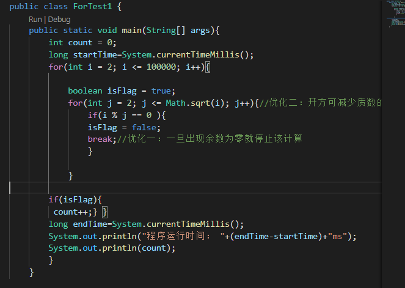
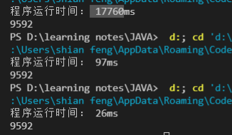
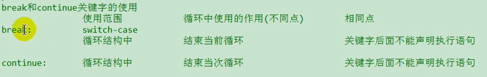

##  Task1:循环结构: ##
### Action1: ###
1. for循环
   1. for循环有四个结构
      1. 初始条件
      2. 循环条件-->要求是boolean类型
      3. 循环体
      4. 迭代条件
   2. for(初始条件; 循环条件; 迭代表达式)
            循环体 
``` java {.line-numbers}
public class ForTest1 {
    public static void main(String[] args){
        int i = 1;
        for(System.out.print("a"); i < 3;System.out.print("c"),i++)
        
            System.out.print("b");
        
        }
    }
```
2. while循环
   1.初始条件
    while(循环条件){
   循环体
   迭代条件 }   
    2. 可以与for循环相互转化，不同在于for循环中的初始条件定义仅在for循环中有效，while循环的初始条件在while之外，在while之外的地方也有效。
3. do-while
   1. 和for和while唯一不同的就是先进行一次循环体，再判断。
4. ==不确定具体循环条件的：for(;;)和while(true)==
   1. 跳出循环的两种方式
      1. 循环条件返回false
      2. 在循环体中执行break语句
5. 嵌套循环
    代码优化所导致的时间问题
    
6. break和continue的使用
    
    1. break和continue默认结束包裹其最近的一层循环结构
    2. 可通过对循环结构加标签的形式来直接定义要结束的循环结构
``` java {.line-numbers}
label:for(int i = 0; i <= 0; i++)
            for(int j = 0; j <= 9; j++)
                if(j % 4 == 0)
                break;
                //break label;
                //continue;
                //continue label;
```